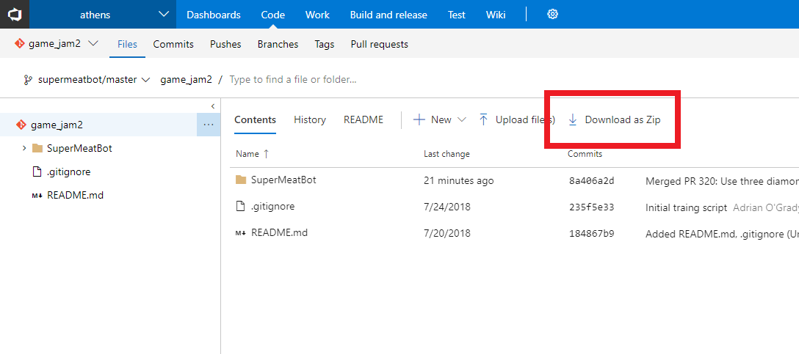
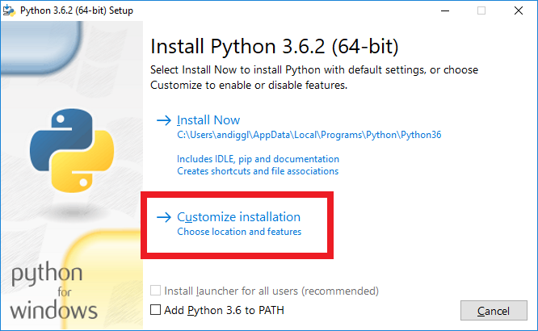
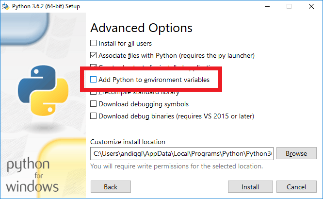
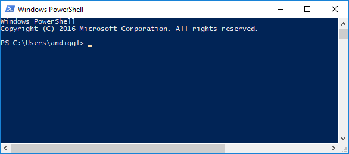
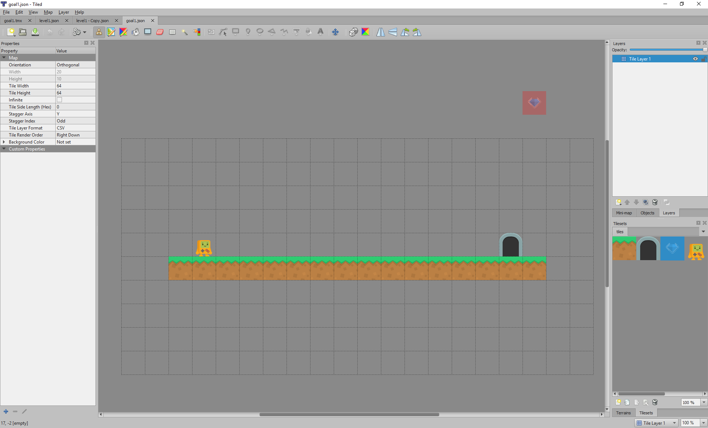
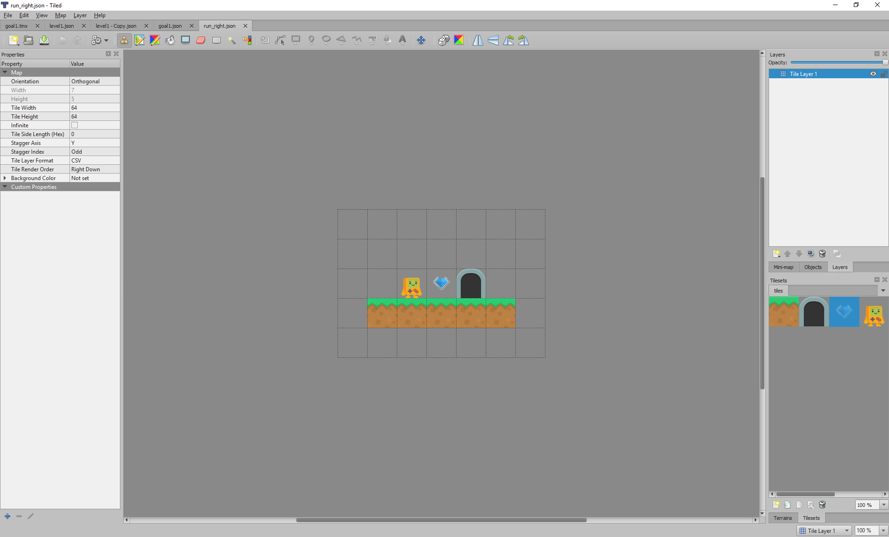
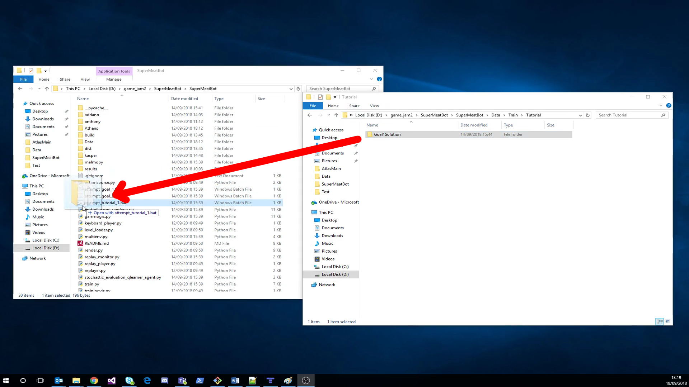
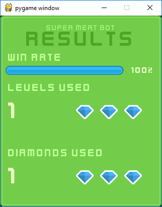
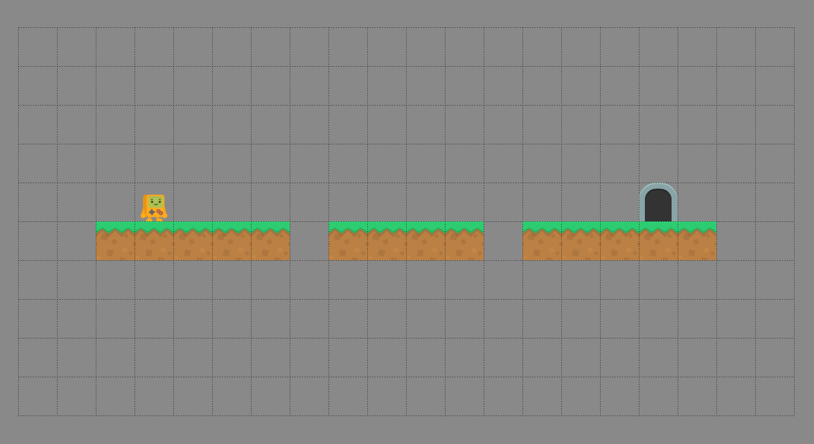
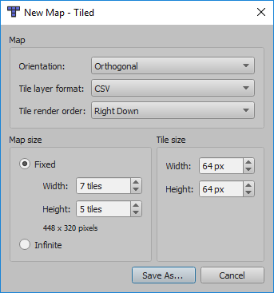

 
# Super Meat Bot Tutorial

Super Meat Bot is a game about teaching robots to play games for you!

## Installing

You can get the latest version of Super Meat Bot from VSTS. Open this [link](https://project-athens.visualstudio.com/athens/_git/game_jam2?version=GBsupermeatbot%2Fmaster), then select &quot;Download as Zip&quot; from the top:

 

Make sure you have Python 3.6.2 installed. Note that this isn&#39;t the latest Python version. You can get Python 3.6.2 for Windows [here](https://www.python.org/ftp/python/3.6.2/python-3.6.2-amd64.exe), or for the whole list of installers go [here](https://www.python.org/downloads/release/python-362/). When installing it, make sure you select &quot;Customize Installation&quot;:

 

Skip over the Optional Features page by immediately pressing &quot;Next&quot;. In Advanced Options, check the &quot;Add Python to environment variables&quot; checkbox:

 

Once installed, we will need the Python dependencies. Open PowerShell by clicking on Start, then typing &quot;powershell&quot; into the search area. You should see a blue screen:

 

Run the following commands.

    python -m pip install --upgrade pip

    pip install gym matplotlib h5py &quot;numpy\&gt;=1.14.0,\&lt;=1.14.5&quot; Pillow chainer\&gt;=4.1.0 chainerrl\&gt;=0.3.0 tensorflow\&gt;=1.5.0 pygame

We&#39;re now set up!

## Playing the Tutorial

First we&#39;re going to look at a simple level that is already solved, then you&#39;ll have a go at the game.

### Just Going Right

In Tiled, open SuperMeatBot\SuperMeatBot\Data\Test\Tutorial\goal1.json

 

This is our goal level. We&#39;ll need to teach our bot to complete this. But how?

In Tiled, open SuperMeatBot\SuperMeatBot\Data\Train\Tutorial\Goal1Solution\run\_right.json

 

We will use this level to train the bot to run right so that it can complete the level above. Using this smaller level will train the bot much faster and much more reliably than using the goal level alone. The bot will move randomly at first, and will receive a reward when it collects a diamond and when it completes the level.

This trains more reliably because the agent is more likely to randomly gather rewards. Once the agent is gathering **any** rewards it can then shape its behaviour to gather those rewards more effectively. In the larger level it is less likely to gather any rewards, so it cannot shape its behaviour towards gathering those rewards.

Let&#39;s test whether this training set is enough to complete the whole level. In Windows Explorer, drag the SuperMeatBot\SuperMeatBot\Data\Train\Tutorial\Goal1Solution folder onto the SuperMeatBot\SuperMeatBot\attempt\_tutorial\_1.bat file.

 

You will see a console immediately appear, and shortly after you will see the agent attempting one of your levels with no skill at all! With our training set and the small target behaviour (just run right), it should learn very fast how to play. We&#39;ll only let it train for 15 runs, which is about 30 seconds. Once it&#39;s trained, we will see it attempting the goal level, and then we&#39;ll get a report on how well we did.

 

It seems we did a great job teaching this bot how to just go right! He managed to reach the exit without falling off 100% of the time (indicated by the Win Rate at the top).

### Your Turn!

As before, open up the goal level – this time it is SuperMeatBot\SuperMeatBot\Data\Test\Tutorial\goal2.json.

 

This level is similar to the previous one, except there are some gaps to jump over.

We should train the bot that it should move right, just like the previous example. We should also train them to jump over the little gaps. This splitting out problems out of the level will be a core part of training our bot for any level we come up against.

To create our training set we need to create a folder. In Tiled, create a new map using FileNewNew map. Use the same settings as below to configure your map:

 

Click &quot;Save As…&quot; and navigate to your new folder. You should save it as a .json file. You can save the file with any file name and this will not affect training, so long as it is a .json file it will be picked up.

 

Create as many levels as you want and save them in that same folder. Once you&#39;re happy with your selection you can train them by dragging your folder onto SuperMeatBot\SuperMeatBot\attempt\_tutorial\_2.bat.

You&#39;ll start seeing your bot learning from your training levels. After 25 runs, they will attempt the goal level. You will see some of the attempts and the end of game result. If the training levels teach the bot the skills to complete the goal level you will get a high win rate, anything over 75% is impressive. Good luck!

### Tips

Try to solve this on your own, but if you do get stuck check out these tips.

- Split the different skills out of the goal level and create a training level for each one. In the tutorial, there are two &quot;skills&quot;:
  - Run right
  - Jump over one-wide gaps
- The bot looks around itself and bases its actions on what it sees. In the goal level the platform is 1 thick, so you should make your training level platforms one thick so you don&#39;t confuse your bot
- If the bot won&#39;t learn no matter what levels you try, you can get a solution training set from SuperMeatBot\SuperMeatBot\Data\Train\Tutorial\Hidden\Goal2Solution

## Next Steps

You can try the other main game levels. These levels will take longer to train but you&#39;ll have a more impressive bot at the end of it!

These are stored in the other attempt\_goal\_X.bat files. If you open them in notepad you can see which goal level they are targeting – this is the path after the &quot;--goal\_level&quot;. It should look similar to &quot;Data\Test\Tutorial\goal2.json&quot;.

Similar to how we trained for the tutorial levels, drag your folder full of training level .json files onto the .bat file to train for it. The game will train then attempt the levels, then report on how suited the training levels are to the goal level.